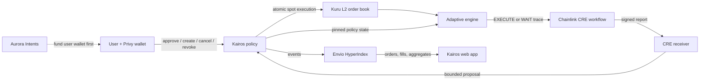

# Kairos

[](https://github.com/EndPx/kairos/actions/workflows/ci.yml)

> Liquidity-aware spot execution with user-owned funds.

Kairos schedules a spot order, sizes each proposed fill against Kuru's executable liquidity, and makes the policy contract re-check every limit before value can move. The initial route is a USDC → MON buy on Monad.

Fixed-size DCA tools ignore the book. Manual order splitting demands constant attention. Kairos combines cumulative pacing with market-aware capacity so a user can set a budget, schedule, effective-average-price ceiling, and fill bounds once—without depositing the unused budget into an escrow contract.

## What makes Kairos different

- **Funds stay in the wallet.** Unspent USDC is never prefunded into Kairos.
- **Automation proposes; the contract decides.** CRE and the adaptive engine cannot override the authorized market, assets, recipient, cumulative release, total budget, or price bounds.
- **Actual settlement drives accounting.** Kairos measures input spent and output received, returns unused input, and forwards MON atomically.
- **Every proof has provenance.** Live testnet actions, CRE simulations, fixed-fork behavior, replays, and fixtures are labeled separately.
- **Wallet access remains explicit.** Privy supplies the embedded wallet and user-signed actions; Kairos does not require a delegated signer.

## Who it is for

Kairos is designed for onchain spot buyers who want to build a position over time but do not want a blind fixed-size bot to walk a thin order book. The initial wedge is active Monad users buying MON with USDC who understand approvals but want policy enforcement, recoverable history, and auditable automation decisions in one interface.

## Architecture



The policy contract remains the final authority even when market conditions change between observation and execution. Aurora funding, when an exact supported route is proven, settles to the user wallet and grants no execution authority by itself.

## Current proof boundary

| Capability | Evidence | Status |
|---|---|---|
| Policy and settlement invariants | Local Solidity suite plus a fixed-block fork that calls the selected Kuru proxy | Proven locally / on a documented fork |
| Adaptive sizing | Integer-only Kuru L2 parser, capacity trace, deterministic EXECUTE/WAIT engine | Proven by replay and tests |
| CRE orchestration | Authenticated CLI simulations with real chain/Kuru reads; separately labeled executable fixture report | Proven as simulation, not deployed delivery |
| Privy lifecycle | Six user-signed Monad Testnet transactions: deploy, approve, create, cancel, revoke | Proven on public testnet |
| Envio history | Public HyperIndex deployment indexed the real create/cancel events and feeds `/orders`, detail, and `/reports` | Proven for lifecycle history |
| Aurora funding | Generic Monad support is documented; the exact source → Monad Testnet → Kuru USDC route is not yet verified | Blocked at exact-route verification |
| Public Kuru trade | Execution-capable public adapter and real settlement are intentionally interlocked | Not claimed |

This boundary is deliberate. A cancelled lifecycle order is not presented as a fill, a fixed fork is not presented as a public trade, and a CRE simulation is not presented as deployed automation.

## Inspect the public lifecycle proof

| Item | Value |
|---|---|
| Network | Monad Testnet, chain ID `10143` |
| Lifecycle policy | [`0x3cBd…3213`](https://testnet.monadexplorer.com/address/0x3cBdB8f7D91966AD543982b76CDb71a0283d3213) |
| Execution-disabled adapter | [`0x2EE9…1269`](https://testnet.monadexplorer.com/address/0x2EE968D016bfF614a516E6e1D469769b9a771269) |
| Indexed order | Order `0`, final state `CANCELLED`, allowance `0` |
| Envio GraphQL | [`f319caf/v1/graphql`](https://indexer.dev.hyperindex.xyz/f319caf/v1/graphql) |
| Full receipt/state record | [`docs/evidence/M3_PRIVY_LIFECYCLE.md`](docs/evidence/M3_PRIVY_LIFECYCLE.md) |
| Envio end-to-end record | [`docs/evidence/M3_ENVIO_LIVE.md`](docs/evidence/M3_ENVIO_LIVE.md) |

The lifecycle policy binds a dead executor and the adapter always rejects execution. It exists only to prove the authorized Privy lifecycle and Envio recovery path without opening public trading.

## Run locally

### Prerequisites

- Node.js `22.x`
- pnpm `10.21.0`
- Git
- WSL/Linux only for Envio code generation on Windows

```bash
corepack enable
corepack prepare pnpm@10.21.0 --activate
pnpm install --frozen-lockfile
```

For a read-only view of the public lifecycle, copy `.env.example` to `apps/web/.env.local` and set:

```dotenv
MONAD_RPC_URL=https://rpc-testnet.monadinfra.com
NEXT_PUBLIC_MONAD_RPC_URL=https://rpc-testnet.monadinfra.com
NEXT_PUBLIC_MONAD_CHAIN_ID=10143
NEXT_PUBLIC_KURU_MARKET_ADDRESS=0xa241896A7Dbe8a550D2E5fF7A914bB1989ceD2D9
NEXT_PUBLIC_USDC_ADDRESS=0x3bA3d39AFcf8bb994f7964B3e0171Ea2Ba361570
NEXT_PUBLIC_KAIROS_POLICY_ADDRESS=0x3cBdB8f7D91966AD543982b76CDb71a0283d3213
ENVIO_GRAPHQL_URL=https://indexer.dev.hyperindex.xyz/f319caf/v1/graphql
```

Then start the application:

```bash
pnpm web:dev
```

Open `http://localhost:3000/orders`. Privy login and wallet actions require your own dashboard-approved App ID, Client ID, and allowed origin. Never commit credentials. The public lifecycle deployment is already cancelled and execution-disabled; it is not a trading target.

## Verify the implementation

```bash
pnpm contracts:compile
pnpm contracts:test
pnpm test
pnpm engine:test
pnpm workflow:test
pnpm indexer:test
pnpm envio:test
pnpm aurora:test
pnpm web:test

pnpm typecheck
pnpm engine:typecheck
pnpm workflow:typecheck
pnpm indexer:typecheck
pnpm aurora:typecheck
pnpm web:typecheck
pnpm web:build
```

Envio generated bindings are intentionally not committed. On Windows, use the checksum-pinned WSL verifier documented in [`packages/envio-indexer/README.md`](packages/envio-indexer/README.md) before running `pnpm envio:typecheck`.

The separately gated fixed-fork suite requires a fork-capable Monad RPC and is documented in [`docs/KURU_FORK_SETTLEMENT.md`](docs/KURU_FORK_SETTLEMENT.md). Default tests do not silently substitute that evidence.

## Repository map

```text
apps/web/                 Next.js application and Privy transaction boundary
packages/contracts/       Policy, Kuru adapter, and CRE receiver contracts
packages/engine/          L2 parsing, capacity estimation, and decision engine
packages/envio-indexer/   HyperIndex config, schema, and event handlers
packages/indexer/         Local recovery/reference projector
packages/shared/          Domain types and integer-unit conventions
packages/aurora/          Exact-route discovery and validation boundary
workflows/kairos/         Chainlink CRE workflow
docs/evidence/            Public receipts and reproducible integration records
```

## Engineering guarantees

- Cumulative released budget and total budget are independent hard limits.
- Maximum effective average price is enforced on actual aggregate input/output, not each individual match.
- Minimum fill, proposal validity, expiry, cancellation, nonce, allowance, and reentrancy protections fail closed.
- Wallet balance and allowance are shared capacity, never treated as reserved per order.
- Missing, stale, malformed, or inconsistent market data produces `WAIT`, never a blind proposal.
- Offchain WAIT decisions remain separate from onchain receipts and Envio settlement history.

The threat model and exact acceptance scenarios are in [`docs/PRODUCT_SPEC_FINAL.md`](docs/PRODUCT_SPEC_FINAL.md) and [`docs/ACCEPTANCE_TESTS.md`](docs/ACCEPTANCE_TESTS.md).

## Sponsor integrations

| Integration | Meaningful use |
|---|---|
| [Kuru](https://docs.kuru.io/) | Verified L2 parsing, integer liquidity capacity, selected-proxy fork execution, and the target public venue path |
| [Chainlink CRE](https://docs.chain.link/cre) | External data plus same-block chain reads, deterministic WAIT/EXECUTE decisions, and encoded receiver reports |
| [Privy](https://docs.privy.io/) | Embedded wallet login and real user-signed approve/create/cancel/revoke transactions |
| [Aurora Intents](https://docs.intents.aurora.dev/) | Cross-chain funding boundary with strict destination token/chain matching before any quote can be treated as usable |
| [Envio HyperIndex](https://docs.envio.dev/docs/HyperIndex/overview) | Live onchain lifecycle history, sync health, recovery behavior, and integer settlement aggregates when fill events exist |

## Submission dossier

- [`docs/SUBMISSION.md`](docs/SUBMISSION.md) — judge brief, validation numbers, demo script, and adoption wedge
- [`EVIDENCE.md`](EVIDENCE.md) — chronological command/result/artifact ledger
- [`STATUS.md`](STATUS.md) — current milestone state and exact blockers
- [`docs/ENVIRONMENT_MATRIX.md`](docs/ENVIRONMENT_MATRIX.md) — pinned versions, networks, contracts, and compatibility
- [`docs/SOURCES.md`](docs/SOURCES.md) — primary-source provenance
- [`WORKPLAN.md`](WORKPLAN.md) — milestone and exit-criteria map

## Honest limitations

Kairos is not yet the final section-19 product. Public Kuru settlement, nonzero Envio fill analytics, deployed CRE delivery, and a verified Aurora funding route remain outstanding. The repository preserves those boundaries instead of turning simulations or lifecycle transactions into broader claims.
